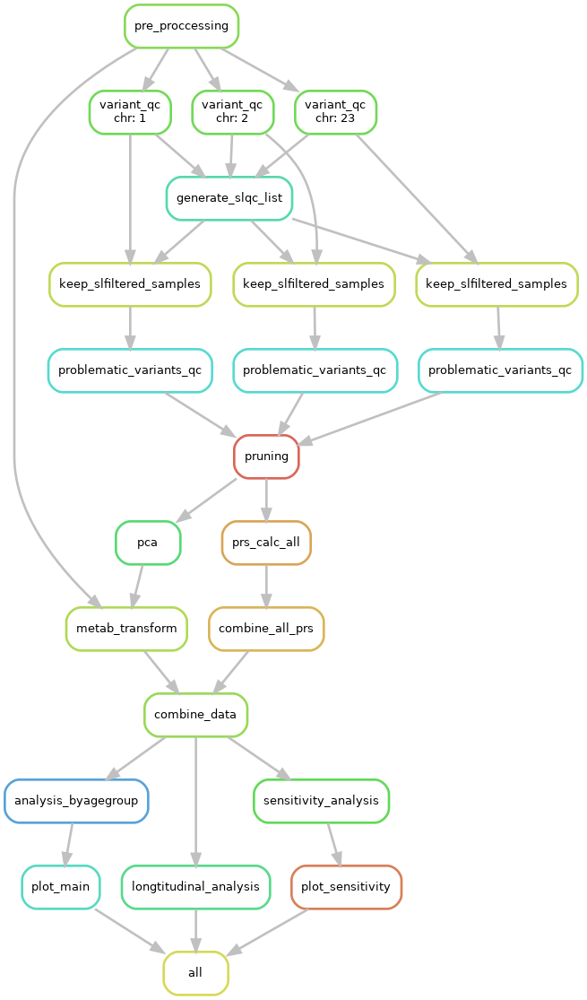

# MSc Dissertation: Evaluating the use of polygenic risk scores in predicting blood lipids in young people 

## Overview
A snakemake pipeline used to process data and conduct analysis in ALSPAC for my dissertation project on evaluating the use of polygenic risk scores in predicting blood lipids in young people.
- Used R to pre-process phenotype data
- Used PLINK2 to perform genetic QC, pruning, and genetic PC analysis
- Used R to transform metabolites / blood lipids
- Used pgsc_calc to calculate PRSs from OmicsPred and PGS Catalogues
- Combined PRS and phenotype data
- Conducted analysis of PRS
- Plotted the results

## Code Structure

```
.
README.md
Snakefile                   # snakefile to run pipeline
config.yaml                 # to set slurm params
dissertation_env.yml        # conda environment
1-Pre-Proccessing     # pre-proccess pheno data
|   ├── 1-Pre-Proccessing.R
|   └── README.txt
2-Genetic-QC          # perform quality control on genetic data
|   ├── 2.1-Variant-level-QC.sh
|   ├── 2.2.1-Generate-SLQC-List.sh
|   ├── 2.2.2-Apply-SL-List.sh
|   ├── 2.3-Pruning.sh
|   └── README.txt
3-Metabolite-Transformation     # transform metabolites
|   ├── 3-Metabolite-Transformation.R
|   └── README.txt
4-PRS-Calculation     # use pgsc_calc to calculate PRS
|   └── README.txt
├── 5-Combine-Data     # combine pheno and PRS data
|   ├── 5-Combine-Data.R
|   └── README.txt
6-PRS-Analysis     # carry out PRS analysis
|   ├── 6.1-PRS-Analysis-By-Age-Group.R
|   ├── 6.2-PRS-Longtitudinal-Analysis.R
|   └── README.txt
7-Plots     # to plot results
    ├── 7-Combined-Plot.R
    └── README.txt

```

## Pipeline overview
